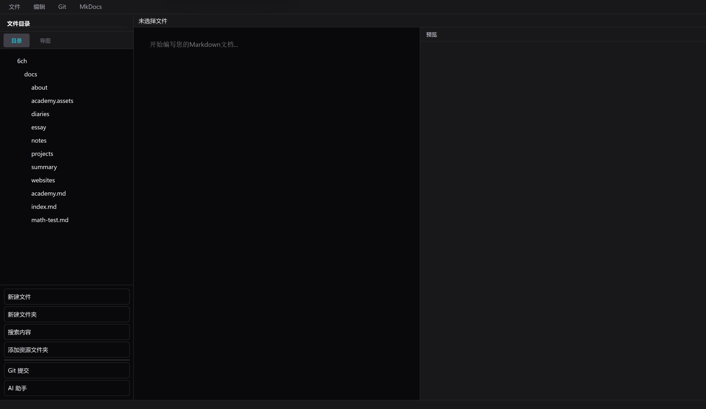
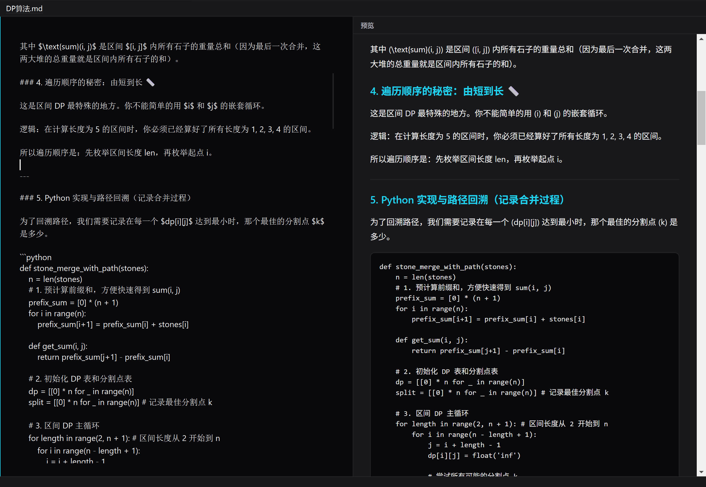
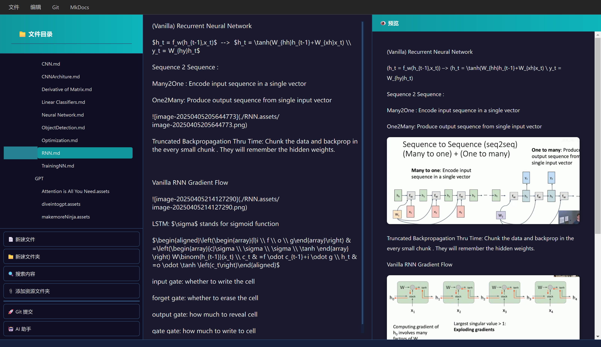
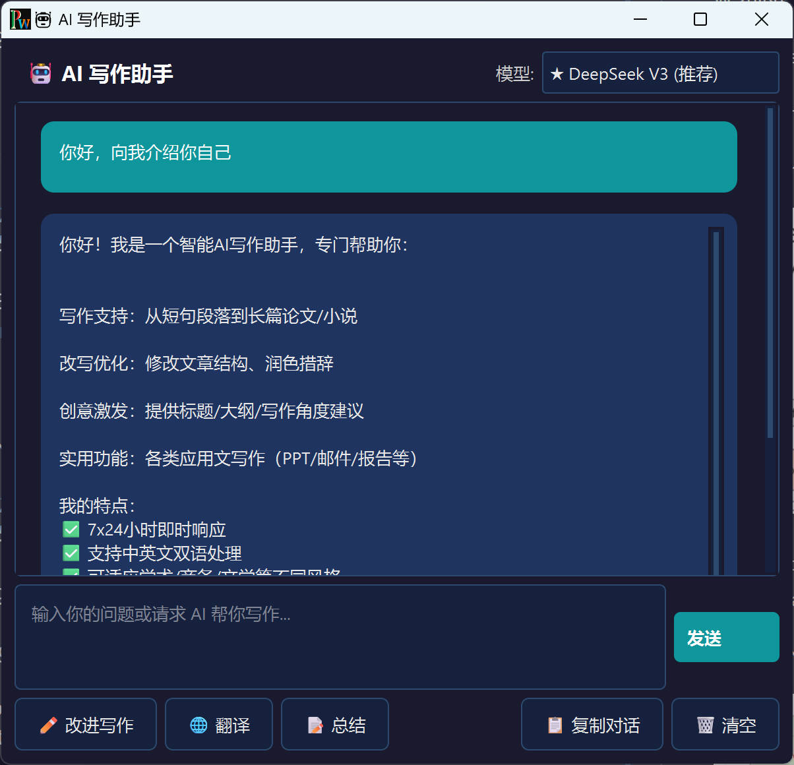
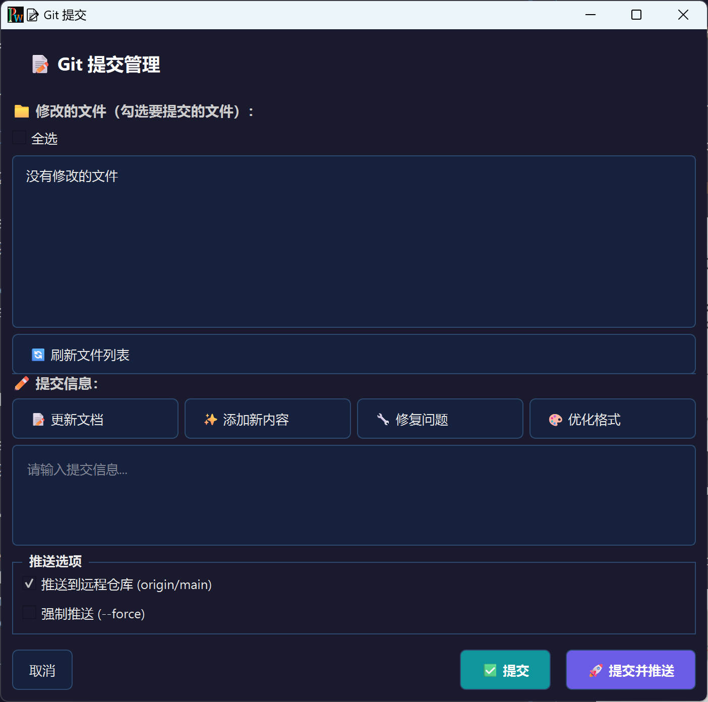

<div align="center">


# Personal Website Manager

<a href="README.md">English</a> | <a href="README_CN.md">简体中文</a>

**A modern, elegant Markdown editor with live preview, Git integration, and AI-powered writing assistance.**

[](LICENSE)
[](https://www.python.org/)
[](https://www.riverbankcomputing.com/software/pyqt/)
[](https://github.com/6chHenry/personal-website-manager)



</div>

---

## ✨ Features

- 📝 **Markdown Editor** - Full-featured Markdown editing with syntax highlighting, matched font with preview
- 👁 **Live Preview** - Real-time preview with beautiful dark theme
- 🌳 **File Tree** - Intuitive file navigation with context menu actions, smart 3-level expansion
- 🧠 **Mind Map View** - Visual directory structure as interactive mind map, supports expand/collapse with sticky viewport
- 🔀 **Git Integration** - Built-in Git support for version control
- 🤖 **AI Assistant** - AI-powered writing assistance with multi-model support (SiliconFlow + Moonshot)
- 🔍 **Content Search** - Search across all Markdown files
- 📐 **Math Rendering** - LaTeX/KaTeX math formula support
- 🖼 **Image Preview** - Built-in image viewer
- 🎨 **Modern UI** - Beautiful dark theme with smooth animations, clean two-column layout

---

## 🚀 What's New

### Mind Map View
Visualize your documentation structure as an interactive mind map. Double-click folders to expand/collapse, with smart viewport persistence that keeps your focus stable.

### Multi-Model AI Assistant
Switch between SiliconFlow models (DeepSeek, Qwen, GLM) and Moonshot (Kimi K2.5) seamlessly. API configuration auto-switches based on your selected model.

### Unified Typography
Editor now uses the same beautiful "霞鹜文楷" (LXGW WenKai) font as the preview, ensuring WYSIWYG editing experience.

### Streamlined Layout
Focused two-column layout (editor + preview) for maximum productivity. No more confusing layout switches.

---

## 📸 Screenshots

<div align="center">
  
  
</div>

<div align="center">
  
  
</div>

---

## 🚀 Quick Start

### Prerequisites

- Python 3.10 or higher
- Git (for version control features)

### Installation

1. **Clone the repository**
   ```bash
   git clone https://github.com/6chHenry/personal-website-manager.git
   cd personal-website-manager
   ```

2. **Create virtual environment** (recommended)
   ```bash
   python -m venv venv
   
   # Windows
   venv\Scripts\activate
   
   # macOS/Linux
   source venv/bin/activate
   ```

3. **Install dependencies**
   ```bash
   pip install -r requirements.txt
   ```

4. **Run the application**
   ```bash
   python main.py
   ```

---

## ⚙️ Configuration

### AI Assistant Setup

To use the AI assistant feature, you need to configure your API key:

1. Create a `config.json` file in the application directory
2. Add your API configuration:
   ```json
   {
     "api_key": "your-api-key-here",
     "api_base": "https://api.siliconflow.cn/v1"
   }
   ```

### Supported AI Models

**SiliconFlow Models:**
- DeepSeek V3 (Recommended)
- DeepSeek R1
- Qwen3-8B
- Qwen2.5 Series (7B/14B/32B)
- Qwen2.5-Coder-7B
- GLM-4-9B
- GLM-Z1-9B

**Moonshot Models:**
- Kimi K2.5

---

## 📖 Documentation

For detailed documentation, please visit our [Wiki](https://github.com/6chHenry/personal-website-manager/wiki).

- [Getting Started](https://github.com/6chHenry/personal-website-manager/wiki/Getting-Started)
- [Features Guide](https://github.com/6chHenry/personal-website-manager/wiki/Features)
- [Configuration](https://github.com/6chHenry/personal-website-manager/wiki/Configuration)
- [Keyboard Shortcuts](https://github.com/6chHenry/personal-website-manager/wiki/Keyboard-Shortcuts)

---

## 🛠️ Tech Stack

- **GUI Framework**: PyQt6
- **Markdown Rendering**: markdown2
- **Syntax Highlighting**: Pygments
- **Math Rendering**: KaTeX / MathJax
- **Version Control**: GitPython
- **AI Integration**: OpenAI-compatible API

---

## 🤝 Contributing

Contributions are welcome! Please feel free to submit a Pull Request.

1. Fork the repository
2. Create your feature branch (`git checkout -b feature/AmazingFeature`)
3. Commit your changes (`git commit -m 'Add some AmazingFeature'`)
4. Push to the branch (`git push origin feature/AmazingFeature`)
5. Open a Pull Request

Please read our [Contributing Guidelines](CONTRIBUTING.md) for more details.

---

## 📝 License

This project is licensed under the MIT License - see the [LICENSE](LICENSE) file for details.

---

## 🙏 Acknowledgments

- [PyQt6](https://www.riverbankcomputing.com/software/pyqt/) - GUI framework
- [markdown2](https://github.com/trentm/python-markdown2) - Markdown parser
- [KaTeX](https://katex.org/) - Math rendering
- [SiliconFlow](https://siliconflow.cn/) - AI API provider
- [Moonshot AI](https://www.moonshot.cn/) - Kimi API provider

---

## 📧 Contact

<!-- Your Name - [@twitter_handle](https://twitter.com/yourhandle) - email@example.com -->

Project Link: [https://github.com/6chHenry/personal-website-manager](https://github.com/6chHenry/personal-website-manager)

---

<div align="center">

**If you find this project helpful, please consider giving it a ⭐️!**

[⬆ Back to Top](#personal-website-manager)

</div>
